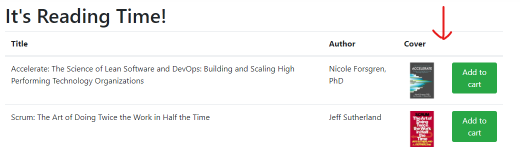
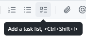
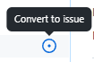
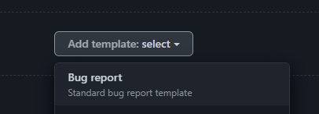

# Lab 1.1 - Planning your Work with Issues

Whether you're a sales-driven "waterfall" org or an agile team practicing Scrum or Kanban, it's important to effectively plan and track the work your team and organisation perform. You also need effective ways to communicate, both within your team and organisation, but also with your communities.

In this lab, you'll work with GitHub Issues to plan and manage some of the work we'll be completing in the remainder of this Workshop.

## Exercise 1 - Creating Issues

Let's create an Issue! 📃

1. Navigate to the `Issues` tab in your repository
2. Click the green `New issue` button
3. Type `Add book ratings` as the title
4. Type `Add a book rating column to the book list` in the description
5. Add an image to the description
    <details>

    - To add an image, you can paste from the clipboard, drag an image file into the browser, or click the bar at the bottom of the text area.
    
    - For this Issue, use the image of the book list here: 
    
    </details>

6. Add a task list using the task list icon at the top of the text area.
    <details>

     
    
    - Add three tasks:
        - Add column to book list
        - Create Book rating property on the model
        - Look up book ratings from the Internet
    </details>

7. In the description field, type `@` and notice you get a dropdown of other org members. If you "@ someone", you'll get a deep link in the issue and they'll be notified.
8. Delete the `@` symbol and type `#`. This time you get a list of other Issues and PRs.
    <details>

    Using this syntax gives you a deep link to other issues.

    **Note:** If you reference another Issue with a `#` inside a task list, it "unfurls" and the status and title is shown when the issue is viewed.
    </details>

9. Assign yourself in the `Assignees` section on the right.
10. Add the `enhancement` label by clicking the cog in the `Labels` section on the right.
11. Change to the Preview tab in the description to ensure it looks correct.
12. Click `Submit new issue`.

13. Hover over one the `Look up book ratings from the Internet` task in your task list, and click the circular `Convert to issue` icon icon to the right.
    <details>

    

    The task should change to a deep link to a newly created Issue
    </details>

14. Click the link to the new issue. Notice under the title that it's being "tracked" by another Issue.
15. Click the link to go back to its parent.
16. Leave a comment on the issue. It can be anything you want!

> **What have you learned?**
> - How to [Create an Issue](https://docs.github.com/en/issues/tracking-your-work-with-issues/creating-an-issue) in a repository
> - How to set various properties of an Issue
> - How to [add a task list](https://docs.github.com/en/get-started/writing-on-github/working-with-advanced-formatting/about-task-lists) and convert tasks to Issues

> **Did you know?**
> - There are many more ways to [create Issues](https://docs.github.com/en/issues/tracking-your-work-with-issues/creating-an-issue) including from comments, code, and discussions.
> - GitHub uses an enhanced version of Markdown called [GitHub Flavored Markdown](https://docs.github.com/en/get-started/writing-on-github/getting-started-with-writing-and-formatting-on-github/about-writing-and-formatting-on-github). You can even [draw diagrams](https://docs.github.com/en/get-started/writing-on-github/working-with-advanced-formatting/creating-diagrams) and include [mathematical expressions](https://docs.github.com/en/get-started/writing-on-github/working-with-advanced-formatting/writing-mathematical-expressions)!


## Exercise 2 - Create more Issues!

Now you know how to create an Issue, it's time to create a small backlog of work for our team. 👷‍♀️

1. Create another Issue to add 2 more books to the list. Use a table for the details.
    <details>

    1. In the description field, type the `/` character to trigger `Slash Commands` and select `Table`.
    2. Choose `3 columns` and `2 rows`.
    3. Fill out the below book details in the resulting markdown table.

    | Title | Author | Image |
    |-----|-----|-----|
    | The DevOps Handbook | Gene Kim, Jez Humble, et. al. | handbook.jpg |
    | The Phoenix Project | Gene Kim, Kevin Behr, et. al. | phoenix.jpg |

    </details>

2. Create a new label for that Issue called `new-book`.
    <details>

    You can create a new label by clicking the cog next to the `Labels` section, typing the new label, and clicking the `Create new label` option.

    Alternatively, you can click the :pencil2: `Edit labels` option for more control.
    </details>

3. Create an Issue to change the `Add to cart` button to `Mark as Reading`

4. Create an Issue to save the current book state to local storage

5. Create an Issue to add a `Read` status to a book.

6. Create an Issue to allow a user to submit their own book rating.

You're welcome to experiment with adding more issues, adjust titles, populating task lists, converting tasks to issues and anything else you can think of!

> **What have you learned?**
> - How to use [Slash Commands](https://docs.github.com/en/issues/tracking-your-work-with-issues/about-slash-commands) to speed up writing complex markdown.
> - How to [Create and manage Labels](https://docs.github.com/en/issues/using-labels-and-milestones-to-track-work/managing-labels) for your issues

> **Did you know?**
> - You can also manage your labels by clicking on the `Labels` link to the right of the `Filter` box in the `Issues` tab of your repository.
> - Organization administrators can [set the default labels that will be included when a new repository is created](https://docs.github.com/articles/managing-default-labels-for-repositories-in-your-organization/).

## Exercise 3 - Issue Templates and Forms

To maintain consistency and ensure we collect all the information we need for issues, GitHub supports Issue Templates and the newer Issue Forms. Both of these simply act as a way to prompt users for the correct information when creating an issue.

First, let's create an Issue Template for a logging a bug. We can do this quickly with preconfigured templates.

1. In your repository, go to `Settings`, then scroll down to the `Features` section.
2. Next to Issues, click `Set up templates`
3. Add a `Bug report` template

    <details>

    
    </details>

4. Click `Propose changes`, then `Commit Changes` (directly to the main branch)
5. Go to the `Issues` tab and create a new Issue. You should see your bug report template as an option. Click `Get started`.
6. Examine the template you're given. Note that it's all still Markdown, but it gives you a starting point.

That's great, but any user can just delete or modify that markdown. Issue Forms takes it one step further, giving the user a form to fill out.

Let's create a simple Issue Form for a Feature Request.

1. Navigate to the Code tab for your repository.
2. Click on the `.github/ISSUE_TEMPLATE/` folder in the file listing
3. Click `Add file` then `Create new file`
4. Name your file `feature-request.yml` and copy-paste the following into the main text area:

    <details>

    ```yaml
    name: Feature Request
    description: Use this form to request a new feature
    title: "Name of new feature"
    labels: ["enhancement"]

    body:
    - type: markdown
        attributes:
        value: |
            :tada: Thanks for Suggesting a new feature! :tada:
            
            Use this form to supply details about the feature you'd like to see.
    
    - id: description
        type: textarea
        attributes:
        label: Description
        description: "Describe the feature including where in the site it should live and what it should do"
        validations:
        required: true

    - id: owner
        type: input
        attributes:
        label: Owner 
        description: Who would own this feature
        placeholder: "@username"

    - id: typeoffeature
        type: dropdown
        attributes:
        label: Type of Feature
        description: "Is the feature entirely new, an enhancement, or a variation on an existing feature?"
        options:
            - New
            - Enhancement
            - Variation
        validations:
        required: true
        
    - id: affectedareas
        type: checkboxes
        attributes:
        label: Areas Affected
        description: "What areas of the application will this affect?"
        options:
            - label: Login/Authentication
            - label: Admin pages
            - label: Public-facing pages
            - label: Back-end and database
    ```
    </details>

5. Commit the new file to the main branch
6. Once again, navigate to the `Issues` tab and create a new Issue
7. This time, choose your new `Feature Request` form.
    <details>
    If you don't see the feature request option, there may be something wrong with your yaml file. Navigate to the file in the Code tab of your repository GitHub should tell you what's wrong!
    </details>
8. Note the difference between this and the template.
9. Use the form to create a new Issue, then look at the resulting issue body. Note that it's still just markdown!

**What have you learned?**
> - How to [create an Issue Template](https://docs.github.com/en/communities/using-templates-to-encourage-useful-issues-and-pull-requests/configuring-issue-templates-for-your-repository#creating-issue-templates) for your repository
> - How to [create an Issue Form](https://docs.github.com/en/communities/using-templates-to-encourage-useful-issues-and-pull-requests/configuring-issue-templates-for-your-repository#creating-issue-forms) for your repository

> **Did you know?**
> - Even though an Issue Form is stricter about the details that get submitted in an issue, the end result is still just markdown in the description field.
> - You can find out the full [syntax for Issue Forms in the GitHub docs](https://docs.github.com/en/communities/using-templates-to-encourage-useful-issues-and-pull-requests/syntax-for-issue-forms).

## Exercise 4 - Browse and filter Issues

Now we have a few Issues, let's start to look at how we can find and filter them.

1. Navigate to the `Issues` tab of your repository.
2. Click the `0 Closed` link at the top of the list. Note how the text in the Filters text box changes.
3. Click the `❎ Clear current search query, filters, and sorts` link under the Filters field. This will reset to your default view.
4. Click the `Label 🔻` dropdown at the top of the list, and select the `enhancement` label.
5. Clear the search query again.
6. Edit the `Filter` textbox to add the text `images` to the search query, and hit `Enter`. You should see any issue with `images` in the title.
    <details>
    The full text should read `is:issue is:open images`
    <details>
7. Clear the search query again so you can see all the issues.
8. Click the checkbox at the top left of the Issue list. This should select all the visible Issues.
9. Click the `Assign` dropdown and choose your own name. This will assign every issue to you.
10. Click the Filters dropdown to the left of the text box and select `Everything mentioning you`. Note the use of the `@me` syntax.

> **What did you learn?**
> - How to filter and search for the list of issues in the `Issues` tab.
> - How to bulk edit issues from the `Issues` tab.


> **Did you know?**
>- You can also use shortcut keys in the browser to apply filters. Try hitting the `a` key on the `Issues` page and you should see the Assignee dropdown expand. You can find out all the browser shortcuts by hitting `?`.
> - The search syntax for issues and pull requests is very powerful. You can find out more [in the GitHub docs](https://docs.github.com/en/search-github/searching-on-github/searching-issues-and-pull-requests).

## Next Steps

- Move on to the next lab! :next_track_button: [Lab 1.2 - Projects](./lab1.2-projects.md)

## Resources
- [About Issues](https://docs.github.com/en/issues/tracking-your-work-with-issues/about-issues)
- [Using task lists](https://docs.github.com/en/get-started/writing-on-github/working-with-advanced-formatting/about-task-lists)
- [Writing on GitHub](https://docs.github.com/en/get-started/writing-on-github)
- [GitHub Flavored Markdown](https://docs.github.com/en/get-started/writing-on-github/getting-started-with-writing-and-formatting-on-github/about-writing-and-formatting-on-github)
- [Slash Commands](https://docs.github.com/en/issues/tracking-your-work-with-issues/about-slash-commands)
- [Issue Forms syntax](https://docs.github.com/en/communities/using-templates-to-encourage-useful-issues-and-pull-requests/syntax-for-issue-forms)
- [Advanced search syntax](https://docs.github.com/en/search-github/searching-on-github/searching-issues-and-pull-requests)